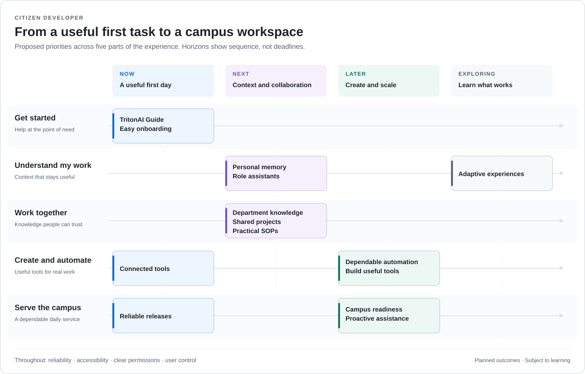

# TritonAI Harness

**An AI workspace for everyday work and software development at UC San Diego.**

Describe a task in your own words, bring in files and context, and work with an AI agent to get it done. TritonAI Harness combines conversations, tools, and reusable skills in one application, with a managed Codex engine connected to TritonAI.

[**Get started**](#get-started) · [Vision and roadmap](#vision-and-roadmap) · [User guides](#using-harness) · [Developers](#development)

## What you can do

- **Work with your files.** Give the agent a task and attach the material it needs to read, explain, or help revise.
- **Keep work organized.** Use separate conversations for tasks and return to previous work with its history.
- **Use reusable skills.** Add instructions for recurring work and discover skills through TritonAI Commons.
- **Build and change software.** Work with source code, terminals, Git, and isolated worktrees in the same workspace.
- **Work across devices.** Use the desktop app or connect to a running Harness server from compatible web and mobile clients.

Optional computer use lets the Codex agent interact with local applications after you enable it. See the [computer-use guide](docs/user/computer-use.md) for setup and supported environments.

## Get started

**You’ll need a Mac or Windows PC, a TritonAI API key, and an internet connection for setup.**

1. Download the [latest TritonAI Installer](https://github.com/dbalders/TritonAI-Installer/releases/latest) for your computer.
2. Run the installer and follow the guided setup. It installs Harness, its managed runtime, and UCSD skills, and configures TritonAI access.
3. Open **TritonAI Harness** and start with a small, specific task. Add relevant files and describe what a useful result would look like.

For example: “Read these notes and draft a checklist. Flag anything that needs clarification.”

The installer handles the runtime setup; you do not need to install Node.js or Codex separately. The upstream `t3` npm package is a separate distribution and does not provide the UCSD-managed setup.

Harness is actively developed. Check the [release notes](https://github.com/dbalders/TritonAI-Harness/releases) for changes in your version and the [update guide](docs/user/updates.md) for keeping it current.

## Vision and roadmap

Our goal is a dependable campus workspace that understands your responsibilities, your projects, and your department’s ways of working. It should be useful whether you’ve never written code or build software every day.

That means growing from individual tasks into shared department knowledge, practical SOPs, role assistants, dependable automation, and tools people can build for their own work. Accessibility, clear permissions, control over memory and sharing, and reliable recovery are part of that goal.



_These are planned outcomes. The horizons describe priorities, not delivery dates or a list of features already available._

<details>
<summary><strong>Read the roadmap as text</strong></summary>

- **Now:** TritonAI Guide, easy onboarding, connected tools, and reliable releases.
- **Next:** Personal memory, role assistants, department knowledge, shared projects, and practical SOPs.
- **Later:** Dependable automation, citizen-built tools, campus readiness, and proactive assistance.
- **Exploring:** Experiences tailored to your role, including where specialized guidance or models meaningfully improve the work.

</details>

### Our next milestone: a useful first day

Someone can open the app, connect a work source, complete a real task, and come back to continue—without needing a developer beside them.

- **Help people get started:** a TritonAI Guide that understands the app and helps with setup, questions, and troubleshooting.
- **Connect everyday work:** useful tool connections with understandable permissions and clear recovery when something goes wrong.
- **Make it dependable:** smooth installation and updates, preserved work, and clear results when actions succeed or fail.

## Using Harness

| I want to…                              | Start here                                           |
| --------------------------------------- | ---------------------------------------------------- |
| Give the agent a task or attach files   | [Messages and context](docs/user/composer.md)        |
| Organize and continue my work           | [Working with threads](docs/user/thread-sidebar.md)  |
| Choose when the agent asks for approval | [Permission modes](docs/user/permission-modes.md)    |
| Use the app from another device         | [Remote access](docs/user/remote-access.md)          |
| Enable interaction with local apps      | [Computer use](docs/user/computer-use.md)            |
| Find or share a reusable skill          | [TritonAI Commons](docs/user/tritonai-commons.md)    |
| Understand the managed AI engine        | [Codex provider guide](docs/user/providers-codex.md) |

Browse the [documentation index](docs/README.md) for more guides.

### Help and feedback

For bugs, installation problems, questions, or feature requests, [open an issue](https://github.com/dbalders/TritonAI-Harness/issues/new/choose). Include your app version, operating system, what you expected, and what happened. Keep API keys and private campus information out of public issues.

Community skill contributions are welcome through [TritonAI Commons](docs/user/tritonai-commons.md). Outside product-code pull requests are not currently accepted; see [CONTRIBUTING.md](CONTRIBUTING.md).

## Development

This repository contains the Harness server and desktop, web, and mobile clients. Development requires Node.js 24 and [Vite+](https://viteplus.dev/guide/).

### Install `vp`

**macOS / Linux**

```bash
curl -fsSL https://vite.plus | bash
```

**Windows**

```powershell
irm https://vite.plus/ps1 | iex
```

### Run locally

From the repository root:

```bash
vp i
vp run dev
```

Open the pairing URL printed by the dev runner. Use `vp run dev:desktop` for the Electron app.

See the [development runbook](docs/operations/development.md) for prerequisites, isolated state, checks, and builds; the [mobile README](apps/mobile/README.md) covers native development.

[Architecture](docs/internals/overview.md) · [Glossary](docs/internals/glossary.md) · [CI and operations](docs/operations/ci.md) · [Secret storage](docs/operations/secret-storage.md) · [Upstream sync](docs/tritonai-sync-automation.md)

## About the project

TritonAI Harness is created and maintained by David Balderston as a UC San Diego-focused distribution of [T3 Code](https://github.com/pingdotgg/t3code). It retains the upstream history and [MIT license](LICENSE), with TritonAI configuration, managed Codex behavior, and campus integrations maintained downstream. See the [downstream notes](docs/tritonai-downstream.md) for those differences.

Related repositories:

- [TritonAI Installer](https://github.com/dbalders/TritonAI-Installer) — guided setup and managed-machine installation.
- [TritonAI Plugins](https://github.com/dbalders/TritonAI-Plugins) — tool integrations and plugin packages.
- [UCSD Skills Library](https://github.com/dbalders/UCSD-Skills-Library) — reusable skills and community contributions.
